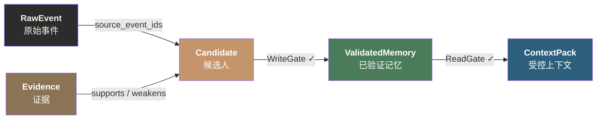
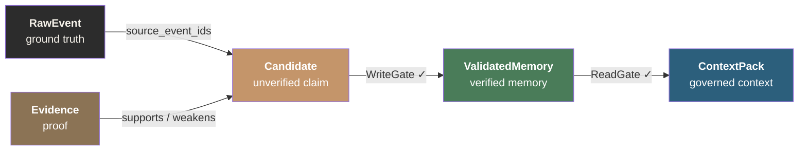

<!--
╔══════════════════════════════════════════════════════════════════════╗
║  DreamSeed 种梦计划 — AI创造者大赛  官方 README 模板                ║
║                                                                      ║
║  使用说明：                                                          ║
║  1. 将本模板放在参赛仓库根目录 README.md 的顶部                       ║
║  2. 头图使用 DreamField 官方公开活动图片地址                         ║
║  3. 请保留 DREAMFIELD_README_HEADER_START / END 标识                 ║
║  4. 分割线以下供创作者自由编写项目内容                               ║
╚══════════════════════════════════════════════════════════════════════╝
-->

<!-- DREAMFIELD_README_HEADER_START -->

<p align="center">
  <a href="https://www.dreamfield.top">
    
  </a>
</p>

<!-- DREAMFIELD_README_HEADER_END -->

<p align="center">
  
</p>

---

<p align="center">
  <a href="#记忆--上下文">中文</a> · <a href="#memory--context">English</a> · <a href="https://github.com/nianpangzhi233/Mnemosyne/issues">Report Bug</a> · <a href="https://github.com/nianpangzhi233/Mnemosyne/issues">Request Feature</a>
</p>

---

<h1 align="center">Mnemosyne</h1>

<p align="center">
  <strong>让 AI 记住重要的事 — 一个记忆系统的思考与实验</strong>
</p>

<p align="center">
  
  
  
  
</p>

---

## Features

- **Governance-first lifecycle** — RawEvent → Candidate → Evidence → ValidatedMemory → ContextPack. 没有捷径。
- **WriteGate** — 5 项拒绝检查，阻止未验证的 LLM 输出成为可信记忆。
- **ReadGate** — 5 项新鲜度/范围/风险过滤，控制什么能进入上下文。
- **Evidence-based verification** — 每条记忆必须有真实事件来源和佐证。
- **3 种接入方式** — CLI、MCP Server、REST API，共用同一套门控逻辑。
- **Auditable ContextPack** — 看到什么被接受了、什么被拒绝了、为什么。
- **Zero-dependency core** — 纯 Python + SQLite，不依赖 LLM、向量数据库或云服务。
- **Notebook-style Dashboard** — 温暖的纸质感 Streamlit 仪表盘。
- **8 个版本的演化** — 每个设计决策背后都是真实的踩坑。
- **反馈驱动 Confidence** — 每次使用记忆后反馈成功/失败，confidence 自动演化。低于阈值自动 stale/deprecate。
- **Tentative Promote（异步验证）** — 只有 source+scope 就能先晋升为 tentative 记忆，用 confidence=0.3 标记"待验证"。
- **记忆冲突检测** — 自动发现重复和关键词冲突（can/cannot、works/broken），标记矛盾记忆。
- **多 Agent 共享记忆** — 按 project_id 共享，agent_id 只做溯源。同一项目下的 Agent 共享已验证记忆。

---

## 记忆 ≠ 上下文

这是我们在构建这个系统过程中得到的最重要的一个认知。

很多人把"给 LLM 塞更多上下文"等同于"让 AI 有记忆"。这是错的。

**上下文是你喂给 LLM 的东西。记忆是 LLM 自己生成、并且被验证过的东西。**

区别在哪？

LLM 是一个概率模型。你问它"torch 2.11.0 在 Windows 上能用吗"，它会基于训练数据概率生成一个回答。这个回答可能是对的，也可能是错的——但 LLM 自己不知道，因为它每次回答都是概率采样。

如果把这个回答直接存起来当成"记忆"，下次遇到类似问题时注入上下文——你就把一个**未验证的概率猜测**变成了**被系统信任的事实**。这就是"幻觉固化"：LLM 的错误回答通过记忆系统获得了不应有的权威性。

**真正的记忆必须经过验证。**

这就是 Mnemosyne V8 存在的原因。它不存储 LLM 说了什么——它存储的是**从事实中提炼、经过证据验证、通过门控审核**的东西。

```text
LLM 说了一句话 → 那只是概率输出，不是记忆
LLM 说了一句话 + 有真实事件来源 + 有证据支撑 + 通过了验证 → 这才是记忆
```

## 为什么是 V8？

这个项目不是一次设计到位的。它经历了 8 个大版本的迭代，每个版本都踩了真实的坑。

```text
V1 — 简单的键值存储。能记住东西，但没有结构。
      问题：存了就存了，没有验证，没有淘汰。

V2 — 加入向量搜索。能语义检索了。
      问题：搜索不等于记忆。top-k 拼接不是上下文治理。

V3 — 知识图谱。节点和边，语义关系。
      问题：图谱会越来越乱。LLM 生成的边不可靠。

V4 — 抽象层重构。解耦存储、嵌入、调度。
      问题：架构变好了，但数据治理问题没解决。

V5 — 记忆进化引擎。做梦机制，自动提取经验。
      问题：LLM 自我总结还是不可靠。AI 自己审自己等于没审。

V6 — MCP 集成。让 AI Agent 能读写记忆。
      问题：接入了但缺少治理。Agent 想写什么就写什么。

V7 — Skill 系统。把经验提炼为可复用技能。
      问题：技能质量参差不齐，缺少验证闭环。

V8 — 彻底的治理优先。
      不再信任 LLM 的输出。一切从 RawEvent（原始事件）开始，
      LLM 生成的内容只能是 Candidate（候选人），
      必须挂 Evidence（证据）并通过 WriteGate（写入门控），
      才能晋升为 ValidatedMemory（已验证记忆）。
```

V8 不是一个渐进改良。它是对前七个版本的反思：**如果一个记忆系统不能区分"LLM 猜的"和"被验证的事实"，它就不是记忆系统，只是一个带搜索的剪贴板。**

## V8 核心架构

### 生命周期流水线

```text
RawEvent → Candidate → Evidence → ValidatedMemory → ContextPack
```

每一步都有门控，没有捷径。



- **RawEvent**：不可变的事实记录。谁做了什么，什么时间，什么结果。地基。
- **Candidate**：LLM 或人工从 RawEvent 中提炼的待验证声明。
- **Evidence**：附加在 Candidate 上的佐证或反驳（`supports` / `weakens` / `contradicts` / `neutral`）。
- **ValidatedMemory**：通过 WriteGate 的 Candidate。只有这个状态才能被注入上下文。
- **ContextPack**：通过 ReadGate 筛选后组装的上下文包。包含被接受和被拒绝的记忆及原因。

### WriteGate — 不是什么都能变成记忆

| 拒绝原因 | 含义 |
|---------|------|
| `missing_source` | 没有挂载 RawEvent 来源 |
| `missing_scope` | 没有归属范围 |
| `missing_supporting_evidence` | 没有佐证 |
| `contradicting_evidence` | 存在反驳证据 |
| `missing_procedural_evidence` | 流程类记忆缺少测试结果 |

**全部通过才能晋升。** 这保证了每条记忆都是可溯源、有证据、有归属的。

### ReadGate — 不是什么都能进入上下文

| 拒绝原因 | 含义 |
|---------|------|
| `stale` | 新鲜度低于阈值 |
| `status_blocked` | 状态不是 validated 或 promoted |
| `risk_blocked` | 风险等级超出策略允许范围 |
| `scope_mismatch` | 范围与当前请求不匹配 |
| `no_task_match` | 任务关键词与记忆内容无交集 |
| `low_confidence` | Confidence 低于策略阈值（默认 0.3） |

被拒绝的记忆会出现在 ContextPack 的 `rejected` 列表中，附上拒绝原因。

### 生命周期降级

```text
promote → tentative → demote / stale / deprecate
```

- **tentative**：只有 source+scope 就能晋升，confidence=0.3。"先用着，等反馈"。
- **demote**：暂时从注入列表移除，保留数据。"暂停使用"。
- **stale**：标记过时，新鲜度归零。"可能不适用了"。
- **deprecate**：永久废弃。"被证明是错的"。

不是所有错误都需要删除，有些只需要标记"慎用"。

### 反馈驱动 Confidence

每条记忆都有一个 confidence 分数（0-1），通过真实使用反馈自动演化：

```text
feedback.record(memory_id, outcome="success")  → confidence += 0.05
feedback.record(memory_id, outcome="failure")  → confidence -= 0.1
```

- confidence ≤ 0.15 → 自动 stale
- 连续 3 次以上 failure → 自动 deprecate

**判断权交给调用方。** Agent 任务千奇百怪，V8 不自动推断成功/失败，由调用方显式报告。

### 记忆冲突检测

```text
conflict.scan(scope) → 检测重复 + 关键词冲突
```

- **重复检测**：content 完全相同的记忆
- **关键词冲突**：can/cannot、works/broken、support/not support 等配对词同时出现

冲突被写入 `memory_conflicts` 表，不会自动删除任何记忆——标记即足够。

### 多 Agent 共享

```text
scope.list_agents(project_id)  → 列出项目下所有 Agent
scope.share_memory(memory_id)  → 标记为项目可见
```

同项目共享已验证记忆，agent_id 只做溯源不做权限控制。不同项目用不同 project_id 隔离。

## 快速上手

### 安装

```bash
git clone https://github.com/nianpangzhi233/Mnemosyne.git
cd Mnemosyne
pip install -e .
```

### 5 分钟演示

```bash
$env:PYTHONPATH = "v8/src"
```

**1. 记录原始事件**

```bash
python -m v8_memory.cli --db "v8/data/v8.db" event add \
  --type tool_error \
  --actor agent \
  --content "PowerShell rejected Bash heredoc syntax." \
  --scope-item project_id=demo --scope-item session_id=test
```

**2. 从事件中提炼候选人**

```bash
python -m v8_memory.cli --db "v8/data/v8.db" candidate add \
  --type claim \
  --content "PowerShell does not support Bash heredoc." \
  --sources <event_id> \
  --scope-item project_id=demo \
  --trigger "debug PowerShell inline command"
```

**3. 挂上证据**

```bash
python -m v8_memory.cli --db "v8/data/v8.db" evidence add \
  --target <candidate_id> \
  --type task_success --polarity supports \
  --content "Using a PowerShell-compatible command fixed the issue." \
  --sources <event_id>
```

**4. 晋升为已验证记忆**

```bash
python -m v8_memory.cli --db "v8/data/v8.db" lifecycle promote \
  --candidate <candidate_id>
```

**5. 构建上下文包**

```bash
python -m v8_memory.cli --db "v8/data/v8.db" context build \
  --task "debug PowerShell inline command" \
  --scope-item project_id=demo --pretty
```

输出：

```json
{
  "items": [
    {
      "id": "mem_...",
      "type": "claim",
      "content": "PowerShell does not support Bash heredoc.",
      "status": "validated",
      "source_events": [
        { "id": "evt_...", "event_type": "tool_error", "content": "PowerShell rejected Bash heredoc syntax." }
      ],
      "evidence": [
        { "type": "task_success", "polarity": "supports", "content": "Using a PowerShell-compatible command fixed the issue." }
      ]
    }
  ],
  "rejected": [],
  "warnings": []
}
```

每条记忆带着来源事件和证据。**可审计、可追溯、可拒绝。**

## 接入方式

三种接入方式，共用同一套门控逻辑：

### CLI

```bash
$env:PYTHONPATH = "v8/src"
python -m v8_memory.cli --db "v8/data/v8.db" <command> [options]
```

### MCP Server（AI Agent 集成）

V8 MCP 工具以 `v8_` 前缀暴露，与 Claude、OpenCode 等 LLM 客户端集成：

```text
v8_event_add → v8_candidate_add → v8_evidence_add → v8_lifecycle_promote → v8_context_build
```

### REST API

```bash
start-v8-api.cmd

curl -X POST http://127.0.0.1:8979/api/v8/events \
  -H "Content-Type: application/json" \
  -d '{"event_type":"tool_error","actor":"agent","content":"...","scope":{"project_id":"demo"}}'
```

完整端点列表见 [v8/README.md](v8/README.md)。

## 设计决策日志

### 为什么用 SQLite 不用 PostgreSQL？

Mnemosyne 的场景是**单用户本地 Agent**，不是多租户 SaaS。SQLite 零配置、零运维、单文件可拷贝。备份就是 `cp v8/data/v8.db backup/`。等真有多租户需求再迁移。过早优化是万恶之源。

### 为什么 Evidence 是独立实体而不是 Candidate 的属性？

同一条证据可能关联多个 Candidate。一个 RawEvent（"torch 2.11.0 在 Windows 上 DLL 崩溃"）可以同时作为多条记忆的证据来源。如果证据只是子字段，就无法表达多对多关系，也无法做证据级溯源。

### 为什么 ContextPack 要包含被拒绝的记忆？

**拒绝本身就是信息。** 知道"哪些记忆被拒绝了、为什么"比只看通过的记忆更有价值。和代码审查中查看 rejected PR 的理由同理。

### 为什么不允许直接写记忆？

LLM 是概率模型。它自信地说出的"经验"可能是幻觉。如果允许直接写入记忆，系统会被未验证的概率输出污染。这就是 V1-V7 最大的教训：**不能信任 LLM 的自我总结**。

## Dashboard

```bash
streamlit run scripts/dashboard/app_v8.py --server.port 8501
```

<p align="center">
  
</p>

笔记本风格只读仪表盘——纸色背景、墨色文字、横格线分隔。记忆系统应该是温暖的、有质感的。

## 项目结构

```text
Mnemosyne/
├── v8/
│   ├── src/v8_memory/       # V8 核心包
│   │   ├── models.py        # 数据模型
│   │   ├── store.py         # SQLite 存储层
│   │   ├── services.py      # 业务逻辑
│   │   ├── gates.py         # WriteGate / ReadGate
│   │   ├── lifecycle.py     # 生命周期管理
│   │   ├── context.py       # ContextPack 构建
│   │   ├── feedback.py      # 反馈驱动 confidence 演化
│   │   ├── conflict.py      # 记忆冲突检测
│   │   ├── agent_scope.py   # 多 Agent 共享记忆
│   │   └── cli.py           # 命令行接口
│   ├── scripts/             # 功能测试脚本
│   └── README.md            # V8 详细技术文档
├── scripts/
│   ├── dashboard/           # Streamlit 仪表盘
│   ├── api/                 # REST API
│   ├── mcp_server/          # MCP Server
│   └── core/                # 共享工具
├── tests/                   # 测试套件
├── docs/                    # 架构文档和设计记录
├── engine/                  # 辅助脚本
└── pyproject.toml           # 包配置
```

## 测试

```bash
python -m unittest discover tests
```

- `test_v8_mvp.py` — 内核生命周期测试
- `test_v8_feedback.py` — 反馈/conflict/scope/tentative/gate 测试
- `test_v8_rest_api.py` — REST API 端点测试
- `test_v8_demo.py` — 端到端演示验证
- `test_v8_dashboard_store.py` — Dashboard 数据层测试
- `test_mcp_v8_surface.py` — MCP 工具接口测试

## 运行条件

- Python 3.10+
- Windows / macOS / Linux
- 可选：PyTorch + sentence-transformers（向量搜索，V8 内核不依赖）
- 可选：FastAPI + uvicorn（REST API）
- 可选：Streamlit（Dashboard）

## 路线图

- [x] 记忆冲突自动检测（多条记忆互相矛盾时主动标记）
- [x] 多 Agent 共享记忆（跨 Agent 的 scope 隔离与共享）
- [x] 反馈驱动 Confidence 演化
- [x] Tentative Promote（异步验证）
- [ ] LLM 驱动的自动 Evidence 生成（保持人工审核）
- [ ] Web Dashboard（替代 Streamlit，更轻量）

## 参与贡献

欢迎提交 Issue 和 Pull Request。

1. Fork 本仓库
2. 创建特性分支：`git checkout -b feature/your-feature`
3. 提交改动：`git commit -m "Add your feature"`
4. 推送分支：`git push origin feature/your-feature`
5. 提交 Pull Request

请确保所有测试通过：`python -m unittest discover tests`

## 更新日志

见 [CHANGELOG.md](CHANGELOG.md)。

## 致谢

这个项目是一个人在下班后的晚上和周末鼓捣出来的。白天是小学老师，教 47 个一年级小朋友。晚上是程序员，教一个 AI 怎么记住重要的事。

如果你觉得这个项目有意思，给个 Star 就是对我最大的鼓励。

## License

[MIT](LICENSE)

---

<!-- English Documentation -->

<h1 align="center">Mnemosyne</h1>

<p align="center">
  <strong>Teaching AI to remember what matters — a memory system built through experimentation</strong>
</p>

<p align="center">
  
  
  
  
</p>

---

## Features

- **Governance-first lifecycle** — RawEvent → Candidate → Evidence → ValidatedMemory → ContextPack. No shortcuts.
- **WriteGate** — 5 rejection checks prevent unverified LLM output from becoming trusted memory.
- **ReadGate** — 5 freshness/scope/risk filters control what enters the LLM context.
- **Evidence-based verification** — Every memory backed by real events and supporting evidence.
- **3 integration paths** — CLI, MCP Server, REST API. Same gate logic everywhere.
- **Auditable ContextPack** — See what was accepted, rejected, and why.
- **Zero-dependency core** — Pure Python + SQLite. No LLM, no vector DB, no cloud.
- **Notebook-style Dashboard** — Warm, paper-textured Streamlit UI.
- **8-version evolution** — Every design decision backed by real failures.
- **Feedback-driven Confidence** — Report success/failure after using a memory; confidence auto-evolves. Auto-stale/deprecate below threshold.
- **Tentative Promote (async verification)** — Promote with only source+scope to tentative (confidence=0.3), verified later through real usage.
- **Memory Conflict Detection** — Auto-detect duplicates and keyword clashes (can/cannot, works/broken). Flag contradictory memories.
- **Multi-Agent Shared Memory** — Share by project_id, trace by agent_id. Agents in the same project share validated memories.

---

## Memory ≠ Context

This is the single most important insight from building this system.

Many people equate "stuffing more context into an LLM" with "giving AI memory." This is wrong.

**Context is what you feed to an LLM. Memory is what the LLM generates and then gets verified.**

Here's the difference:

An LLM is a probabilistic model. Ask it "does torch 2.11.0 work on Windows?" and it'll give you an answer based on training data probabilities. That answer might be right or wrong — the LLM doesn't know, because every response is probabilistic sampling.

If you store that answer directly as "memory" and inject it as context next time a similar question comes up — you've just turned an **unverified probabilistic guess** into a **system-trusted fact**. This is "hallucination solidification": LLM errors gaining undeserved authority through the memory system.

**Real memory must be verified.**

That's why Mnemosyne V8 exists. It doesn't store what the LLM said — it stores things **extracted from facts, backed by evidence, approved through gates**.

```text
LLM says something → that's just probabilistic output, not memory
LLM says something + has real event sources + has evidence + passed verification → THAT is memory
```

## Why V8?

This project wasn't designed in one shot. It went through 8 major versions, each learning from real failures.

```text
V1 — Simple key-value store. Could remember things, no structure.
      Problem: stored forever, no verification, no eviction.

V2 — Added vector search. Semantic retrieval worked.
      Problem: search ≠ memory. Top-k concatenation is not context governance.

V3 — Knowledge graph. Nodes and edges, semantic relationships.
      Problem: graphs get messy. LLM-generated edges are unreliable.

V4 — Abstraction layer refactor. Decoupled storage, embedding, scheduling.
      Problem: better architecture, same data governance problems.

V5 — Memory evolution engine. Dream mechanism, automatic experience extraction.
      Problem: LLM self-summarization is unreliable. AI auditing itself = no audit.

V6 — MCP integration. Let AI agents read/write memory.
      Problem: connected but ungoverned. Agents write whatever they want.

V7 — Skill system. Distill experiences into reusable skills.
      Problem: skill quality varied, no verification loop.

V8 — Governance-first. From the ground up.
      No longer trusts LLM output. Everything starts from RawEvent.
      LLM-generated content can only be a Candidate.
      Must attach Evidence and pass WriteGate
      to become ValidatedMemory.
```

V8 is not an incremental improvement. It's a reflection on seven previous versions: **if a memory system can't distinguish "LLM guessed it" from "verified fact", it's not a memory system — it's a clipboard with search.**

## V8 Core Architecture

### Lifecycle Pipeline

```text
RawEvent → Candidate → Evidence → ValidatedMemory → ContextPack
```

Every step has a gate. No shortcuts.



### WriteGate — Not everything becomes memory

| Rejection Reason | Meaning |
|-----------------|---------|
| `missing_source` | No RawEvent sources attached |
| `missing_scope` | No scope (project, session) assigned |
| `missing_supporting_evidence` | No supporting evidence |
| `contradicting_evidence` | Contradicting evidence exists |
| `missing_procedural_evidence` | Procedure-type candidate lacks test result evidence |

**All checks must pass for promotion.** Every memory is traceable, evidenced, and scoped.

### ReadGate — Not everything enters context

| Rejection Reason | Meaning |
|-----------------|---------|
| `stale` | Freshness below threshold |
| `status_blocked` | Status is not validated or promoted |
| `risk_blocked` | Risk level outside policy |
| `scope_mismatch` | Scope doesn't match request |
| `no_task_match` | Task keywords don't overlap with memory content |
| `low_confidence` | Confidence below policy threshold (default 0.3) |

Rejected memories appear in ContextPack's `rejected` list with reasons. **Everything is auditable.**

### Lifecycle Demotion

```text
promote → tentative → demote / stale / deprecate
```

- **tentative**: Promote with only source+scope, confidence=0.3. "Use it first, verify later."
- **demote**: Temporarily remove from injection, keep data. "Paused."
- **stale**: Mark outdated, freshness to zero. "May no longer apply."
- **deprecate**: Permanent retirement. "Proven wrong."

Not every error needs deletion. Some just need a "use with caution" label.

### Feedback-driven Confidence

Every memory has a confidence score (0-1) that evolves through real usage feedback:

```text
feedback.record(memory_id, outcome="success")  → confidence += 0.05
feedback.record(memory_id, outcome="failure")  → confidence -= 0.1
```

- confidence ≤ 0.15 → auto-stale
- 3+ consecutive failures → auto-deprecate

**The caller decides success or failure.** Agent tasks are too diverse for generic inference — callers report explicitly.

### Memory Conflict Detection

```text
conflict.scan(scope) → detect duplicates + keyword clashes
```

- **Duplicate detection**: Identical content across memories
- **Keyword clash**: Opposing pairs like can/cannot, works/broken, support/not support appearing together

Conflicts are written to `memory_conflicts` table. No auto-deletion — flagging is enough.

### Multi-Agent Sharing

```text
scope.list_agents(project_id)  → list all agents in a project
scope.share_memory(memory_id)  → mark as project-visible
```

Agents in the same project share validated memories. agent_id is for traceability only, not access control. Different projects are isolated by project_id.

## Quick Start

### Install

```bash
git clone https://github.com/nianpangzhi233/Mnemosyne.git
cd Mnemosyne
pip install -e .
```

### 5-Minute Demo

```bash
export PYTHONPATH="v8/src"
```

**1. Record a raw event**

```bash
python -m v8_memory.cli --db "v8/data/v8.db" event add \
  --type tool_error --actor agent \
  --content "PowerShell rejected Bash heredoc syntax." \
  --scope-item project_id=demo --scope-item session_id=test
```

**2. Extract a candidate from the event**

```bash
python -m v8_memory.cli --db "v8/data/v8.db" candidate add \
  --type claim \
  --content "PowerShell does not support Bash heredoc." \
  --sources <event_id> \
  --scope-item project_id=demo \
  --trigger "debug PowerShell inline command"
```

**3. Attach evidence**

```bash
python -m v8_memory.cli --db "v8/data/v8.db" evidence add \
  --target <candidate_id> \
  --type task_success --polarity supports \
  --content "Using a PowerShell-compatible command fixed the issue." \
  --sources <event_id>
```

**4. Promote to validated memory**

```bash
python -m v8_memory.cli --db "v8/data/v8.db" lifecycle promote \
  --candidate <candidate_id>
```

**5. Build a context pack**

```bash
python -m v8_memory.cli --db "v8/data/v8.db" context build \
  --task "debug PowerShell inline command" \
  --scope-item project_id=demo --pretty
```

Output:

```json
{
  "items": [
    {
      "id": "mem_...",
      "type": "claim",
      "content": "PowerShell does not support Bash heredoc.",
      "status": "validated",
      "source_events": [
        { "id": "evt_...", "event_type": "tool_error", "content": "PowerShell rejected Bash heredoc syntax." }
      ],
      "evidence": [
        { "type": "task_success", "polarity": "supports", "content": "Using a PowerShell-compatible command fixed the issue." }
      ]
    }
  ],
  "rejected": [],
  "warnings": []
}
```

Every memory carries source events and evidence. **Auditable, traceable, rejectable.**

## Integration

Three integration methods, all sharing the same gate logic:

### CLI

```bash
export PYTHONPATH="v8/src"
python -m v8_memory.cli --db "v8/data/v8.db" <command> [options]
```

### MCP Server (AI Agent Integration)

V8 MCP tools are exposed with the `v8_` prefix for Claude, OpenCode, and other LLM clients:

```text
v8_event_add → v8_candidate_add → v8_evidence_add → v8_lifecycle_promote → v8_context_build
```

### REST API

```bash
python scripts/api/app.py

curl -X POST http://127.0.0.1:8979/api/v8/events \
  -H "Content-Type: application/json" \
  -d '{"event_type":"tool_error","actor":"agent","content":"...","scope":{"project_id":"demo"}}'
```

See [v8/README.md](v8/README.md) for the full endpoint list.

## Design Decision Log

### Why SQLite over PostgreSQL?

Mnemosyne targets **single-user local agents**, not multi-tenant SaaS. SQLite is zero-config, zero-maintenance, single-file portable. Backup is `cp v8/data/v8.db backup/`. Migrate when multi-tenancy is actually needed. Premature optimization is the root of all evil.

### Why is Evidence an independent entity?

The same evidence can support multiple Candidates. One RawEvent ("torch 2.11.0 DLL crash on Windows") can back multiple memories. If evidence were just a sub-field, you'd lose many-to-many relationships and evidence-level traceability.

### Why include rejected memories in ContextPack?

**Rejection is information.** Knowing what was rejected and why is more valuable than only seeing what passed. Same principle as reviewing rejected PRs in code review.

### Why not allow direct memory writes?

LLMs are probabilistic. Their confident "experience" may be hallucination. Allowing direct writes pollutes the system with unverified probabilistic output. This is the biggest lesson from V1-V7: **never trust LLM self-summarization.**

## Dashboard

```bash
streamlit run scripts/dashboard/app_v8.py --server.port 8501
```

<p align="center">
  
</p>

A notebook-style read-only dashboard — paper background, ink text, ruled line separators. A memory system should feel warm and textured.

## Project Structure

```text
Mnemosyne/
├── v8/
│   ├── src/v8_memory/       # V8 core package
│   │   ├── models.py        # Data models
│   │   ├── store.py         # SQLite storage layer
│   │   ├── services.py      # Business logic
│   │   ├── gates.py         # WriteGate / ReadGate
│   │   ├── lifecycle.py     # Lifecycle management
│   │   ├── context.py       # ContextPack builder
│   │   ├── feedback.py      # Feedback-driven confidence
│   │   ├── conflict.py      # Memory conflict detection
│   │   ├── agent_scope.py   # Multi-agent shared memory
│   │   └── cli.py           # CLI interface
│   ├── scripts/             # Functional test scripts
│   └── README.md            # Detailed V8 technical docs
├── scripts/
│   ├── dashboard/           # Streamlit dashboard
│   ├── api/                 # REST API
│   ├── mcp_server/          # MCP Server
│   └── core/                # Shared utilities
├── tests/                   # Test suite
├── docs/                    # Architecture docs and design records
├── engine/                  # Helper scripts
└── pyproject.toml           # Package config
```

## Testing

```bash
python -m unittest discover tests
```

- `test_v8_mvp.py` — Core lifecycle tests
- `test_v8_feedback.py` — Feedback/conflict/scope/tentative/gate tests
- `test_v8_rest_api.py` — REST API endpoint tests
- `test_v8_demo.py` — End-to-end demo verification
- `test_v8_dashboard_store.py` — Dashboard data layer tests
- `test_mcp_v8_surface.py` — MCP tool interface tests

## Requirements

- Python 3.10+
- Windows / macOS / Linux
- Optional: PyTorch + sentence-transformers (vector search; V8 core has no dependency)
- Optional: FastAPI + uvicorn (REST API)
- Optional: Streamlit (Dashboard)

## Roadmap

- [x] Automatic memory conflict detection (flag contradictory memories)
- [x] Multi-agent shared memory (scope isolation and sharing across agents)
- [x] Feedback-driven confidence evolution
- [x] Tentative promote (async verification)
- [ ] LLM-driven automatic Evidence generation (with human review)
- [ ] Web Dashboard (replacing Streamlit, lighter weight)

## Contributing

Issues and Pull Requests are welcome.

1. Fork this repo
2. Create a feature branch: `git checkout -b feature/your-feature`
3. Commit your changes: `git commit -m "Add your feature"`
4. Push to the branch: `git push origin feature/your-feature`
5. Submit a Pull Request

Please ensure all tests pass: `python -m unittest discover tests`

## Changelog

See [CHANGELOG.md](CHANGELOG.md).

## Acknowledgments

This project was built by one person during evenings and weekends after work. By day, a primary school teacher with 47 first-graders. By night, a programmer teaching an AI how to remember what matters.

If you find this project interesting, a Star would mean a lot.

## License

[MIT](LICENSE)
