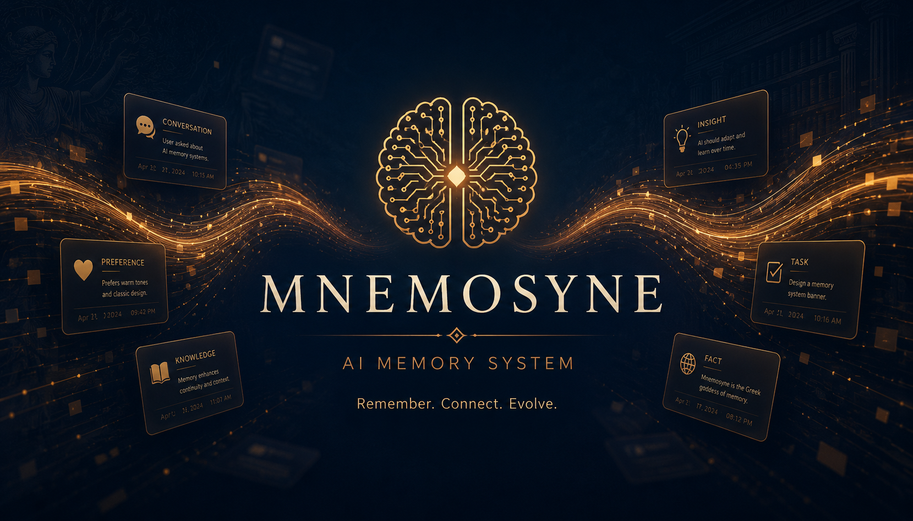
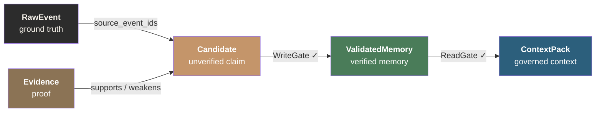
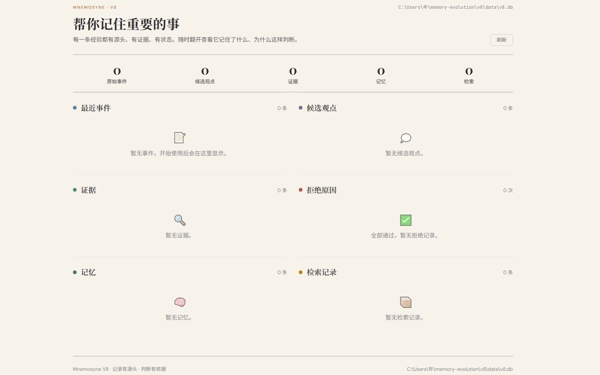

<!--
╔══════════════════════════════════════════════════════════════════════╗
║  DreamSeed 种梦计划 — AI创造者大赛  官方 README 模板                ║
║                                                                      ║
║  使用说明：                                                          ║
║  1. 将本模板放在参赛仓库根目录 README.md 的顶部                       ║
║  2. 头图使用 DreamField 官方公开活动图片地址                         ║
║  3. 请保留 DREAMFIELD_README_HEADER_START / END 标识                 ║
║  4. 分割线以下供创作者自由编写项目内容                               ║
╚══════════════════════════════════════════════════════════════════════╝
-->

<!-- DREAMFIELD_README_HEADER_START -->

<p align="center">
  <a href="https://www.dreamfield.top">
    
  </a>
</p>

<!-- DREAMFIELD_README_HEADER_END -->

<p align="center">
  
</p>

---

<p align="center">
  <strong>English documentation is available below.</strong>
</p>

---

<h1 align="center">Mnemosyne</h1>

<p align="center">
  <strong>让 AI 记住重要的事 — 一个记忆系统的思考与实验</strong>
</p>

<p align="center">
  
  
  
  
</p>

---

## Features

- **Governance-first lifecycle** — RawEvent → Candidate → Evidence → ValidatedMemory → ContextPack. No shortcuts.
- **WriteGate** — 5 rejection checks prevent unverified LLM output from becoming trusted memory.
- **ReadGate** — 5 freshness/scope/risk filters control what enters the LLM context.
- **Evidence-based verification** — Every memory backed by real events and supporting evidence.
- **3 integration paths** — CLI, MCP Server, REST API. Same gate logic everywhere.
- **Auditable ContextPack** — See what was accepted, rejected, and why.
- **Zero-dependency core** — Pure Python + SQLite. No LLM, no vector DB, no cloud.
- **Notebook-style Dashboard** — Warm, paper-textured Streamlit UI.
- **8-version evolution** — Every design decision backed by real failures.

---

## Memory ≠ Context

This is the single most important insight from building this system.

Many people equate "stuffing more context into an LLM" with "giving AI memory." This is wrong.

**Context is what you feed to an LLM. Memory is what the LLM generates and then gets verified.**

Here's the difference:

An LLM is a probabilistic model. Ask it "does torch 2.11.0 work on Windows?" and it'll give you an answer based on training data probabilities. That answer might be right or wrong — the LLM doesn't know, because every response is probabilistic sampling.

If you store that answer directly as "memory" and inject it as context next time a similar question comes up — you've just turned an **unverified probabilistic guess** into a **system-trusted fact**. This is "hallucination solidification": LLM errors gaining undeserved authority through the memory system.

**Real memory must be verified.**

That's why Mnemosyne V8 exists. It doesn't store what the LLM said — it stores things **extracted from facts, backed by evidence, approved through gates**.

```text
LLM says something → that's just probabilistic output, not memory
LLM says something + has real event sources + has evidence + passed verification → THAT is memory
```

## Why V8?

This project wasn't designed in one shot. It went through 8 major versions, each learning from real failures.

```text
V1 — Simple key-value store. Could remember things, no structure.
      Problem: stored forever, no verification, no eviction.

V2 — Added vector search. Semantic retrieval worked.
      Problem: search ≠ memory. Top-k concatenation is not context governance.

V3 — Knowledge graph. Nodes and edges, semantic relationships.
      Problem: graphs get messy. LLM-generated edges are unreliable.

V4 — Abstraction layer refactor. Decoupled storage, embedding, scheduling.
      Problem: better architecture, same data governance problems.

V5 — Memory evolution engine. Dream mechanism, automatic experience extraction.
      Problem: LLM self-summarization is unreliable. AI auditing itself = no audit.

V6 — MCP integration. Let AI agents read/write memory.
      Problem: connected but ungoverned. Agents write whatever they want.

V7 — Skill system. Distill experiences into reusable skills.
      Problem: skill quality varied, no verification loop.

V8 — Governance-first. From the ground up.
      No longer trusts LLM output. Everything starts from RawEvent.
      LLM-generated content can only be a Candidate.
      Must attach Evidence and pass WriteGate
      to become ValidatedMemory.
```

V8 is not an incremental improvement. It's a reflection on seven previous versions: **if a memory system can't distinguish "LLM guessed it" from "verified fact", it's not a memory system — it's a clipboard with search.**

## V8 Core Architecture

### Lifecycle Pipeline

```text
RawEvent → Candidate → Evidence → ValidatedMemory → ContextPack
```

Every step has a gate. No shortcuts.



### WriteGate — Not everything becomes memory

| Rejection Reason | Meaning |
|-----------------|---------|
| `missing_source` | No RawEvent sources attached |
| `missing_scope` | No scope (project, session) assigned |
| `missing_supporting_evidence` | No supporting evidence |
| `contradicting_evidence` | Contradicting evidence exists |
| `missing_procedural_evidence` | Procedure-type candidate lacks test result evidence |

**All checks must pass for promotion.** Every memory is traceable, evidenced, and scoped.

### ReadGate — Not everything enters context

| Rejection Reason | Meaning |
|-----------------|---------|
| `stale` | Freshness below threshold |
| `status_blocked` | Status is not validated or promoted |
| `risk_blocked` | Risk level outside policy |
| `scope_mismatch` | Scope doesn't match request |
| `no_task_match` | Task keywords don't overlap with memory content |

Rejected memories appear in ContextPack's `rejected` list with reasons. **Everything is auditable.**

### Lifecycle Demotion

```text
promote → demote / stale / deprecate
```

- **demote**: Temporarily remove from injection, keep data. "Paused."
- **stale**: Mark outdated, freshness to zero. "May no longer apply."
- **deprecate**: Permanent retirement. "Proven wrong."

Not every error needs deletion. Some just need a "use with caution" label.

## Quick Start

### Install

```bash
git clone https://github.com/nianpangzhi233/Mnemosyne.git
cd Mnemosyne
pip install -e .
```

### 5-Minute Demo

```bash
export PYTHONPATH="v8/src"
```

**1. Record a raw event**

```bash
python -m v8_memory.cli --db "v8/data/v8.db" event add \
  --type tool_error --actor agent \
  --content "PowerShell rejected Bash heredoc syntax." \
  --scope-item project_id=demo --scope-item session_id=test
```

**2. Extract a candidate from the event**

```bash
python -m v8_memory.cli --db "v8/data/v8.db" candidate add \
  --type claim \
  --content "PowerShell does not support Bash heredoc." \
  --sources <event_id> \
  --scope-item project_id=demo \
  --trigger "debug PowerShell inline command"
```

**3. Attach evidence**

```bash
python -m v8_memory.cli --db "v8/data/v8.db" evidence add \
  --target <candidate_id> \
  --type task_success --polarity supports \
  --content "Using a PowerShell-compatible command fixed the issue." \
  --sources <event_id>
```

**4. Promote to validated memory**

```bash
python -m v8_memory.cli --db "v8/data/v8.db" lifecycle promote \
  --candidate <candidate_id>
```

**5. Build a context pack**

```bash
python -m v8_memory.cli --db "v8/data/v8.db" context build \
  --task "debug PowerShell inline command" \
  --scope-item project_id=demo --pretty
```

Output:

```json
{
  "items": [
    {
      "id": "mem_...",
      "type": "claim",
      "content": "PowerShell does not support Bash heredoc.",
      "status": "validated",
      "source_events": [
        { "id": "evt_...", "event_type": "tool_error", "content": "PowerShell rejected Bash heredoc syntax." }
      ],
      "evidence": [
        { "type": "task_success", "polarity": "supports", "content": "Using a PowerShell-compatible command fixed the issue." }
      ]
    }
  ],
  "rejected": [],
  "warnings": []
}
```

Every memory carries source events and evidence. **Auditable, traceable, rejectable.**

## Integration

Three integration methods, all sharing the same gate logic:

### CLI

```bash
export PYTHONPATH="v8/src"
python -m v8_memory.cli --db "v8/data/v8.db" <command> [options]
```

### MCP Server (AI Agent Integration)

V8 MCP tools are exposed with the `v8_` prefix for Claude, OpenCode, and other LLM clients:

```text
v8_event_add → v8_candidate_add → v8_evidence_add → v8_lifecycle_promote → v8_context_build
```

### REST API

```bash
python scripts/api/app.py

curl -X POST http://127.0.0.1:8979/api/v8/events \
  -H "Content-Type: application/json" \
  -d '{"event_type":"tool_error","actor":"agent","content":"...","scope":{"project_id":"demo"}}'
```

See [v8/README.md](v8/README.md) for the full endpoint list.

## Design Decision Log

### Why SQLite over PostgreSQL?

Mnemosyne targets **single-user local agents**, not multi-tenant SaaS. SQLite is zero-config, zero-maintenance, single-file portable. Backup is `cp v8/data/v8.db backup/`. Migrate when multi-tenancy is actually needed. Premature optimization is the root of all evil.

### Why is Evidence an independent entity?

The same evidence can support multiple Candidates. One RawEvent ("torch 2.11.0 DLL crash on Windows") can back multiple memories. If evidence were just a sub-field, you'd lose many-to-many relationships and evidence-level traceability.

### Why include rejected memories in ContextPack?

**Rejection is information.** Knowing what was rejected and why is more valuable than only seeing what passed. Same principle as reviewing rejected PRs in code review.

### Why not allow direct memory writes?

LLMs are probabilistic. Their confident "experience" may be hallucination. Allowing direct writes pollutes the system with unverified probabilistic output. This is the biggest lesson from V1-V7: **never trust LLM self-summarization.**

## Dashboard

```bash
streamlit run scripts/dashboard/app_v8.py --server.port 8501
```

<p align="center">
  
</p>

A notebook-style read-only dashboard — paper background, ink text, ruled line separators. A memory system should feel warm and textured.

## Project Structure

```text
Mnemosyne/
├── v8/
│   ├── src/v8_memory/       # V8 core package
│   │   ├── models.py        # Data models
│   │   ├── store.py         # SQLite storage layer
│   │   ├── services.py      # Business logic
│   │   ├── gates.py         # WriteGate / ReadGate
│   │   ├── lifecycle.py     # Lifecycle management
│   │   ├── context.py       # ContextPack builder
│   │   └── cli.py           # CLI interface
│   ├── scripts/             # Functional test scripts
│   └── README.md            # Detailed V8 technical docs
├── scripts/
│   ├── dashboard/           # Streamlit dashboard
│   ├── api/                 # REST API
│   ├── mcp_server/          # MCP Server
│   └── core/                # Shared utilities
├── tests/                   # Test suite
├── docs/                    # Architecture docs and design records
├── engine/                  # Helper scripts
└── pyproject.toml           # Package config
```

## Testing

```bash
python -m unittest discover tests
```

- `test_v8_mvp.py` — Core lifecycle tests
- `test_v8_rest_api.py` — REST API endpoint tests
- `test_v8_demo.py` — End-to-end demo verification
- `test_v8_dashboard_store.py` — Dashboard data layer tests
- `test_mcp_v8_surface.py` — MCP tool interface tests

## Requirements

- Python 3.10+
- Windows / macOS / Linux
- Optional: PyTorch + sentence-transformers (vector search; V8 core has no dependency)
- Optional: FastAPI + uvicorn (REST API)
- Optional: Streamlit (Dashboard)

## Roadmap

- [ ] LLM-driven automatic Evidence generation (with human review)
- [ ] Automatic memory conflict detection (flag contradictory memories)
- [ ] Multi-agent shared memory (scope isolation and sharing across agents)
- [ ] Web Dashboard (replacing Streamlit, lighter weight)

## Contributing

Issues and Pull Requests are welcome.

1. Fork this repo
2. Create a feature branch: `git checkout -b feature/your-feature`
3. Commit your changes: `git commit -m "Add your feature"`
4. Push to the branch: `git push origin feature/your-feature`
5. Submit a Pull Request

Please ensure all tests pass: `python -m unittest discover tests`

## Changelog

See [CHANGELOG.md](CHANGELOG.md).

## Acknowledgments

This project was built by one person during evenings and weekends after work. By day, a primary school teacher with 47 first-graders. By night, a programmer teaching an AI how to remember what matters.

If you find this project interesting, a Star would mean a lot.

## License

[MIT](LICENSE)
