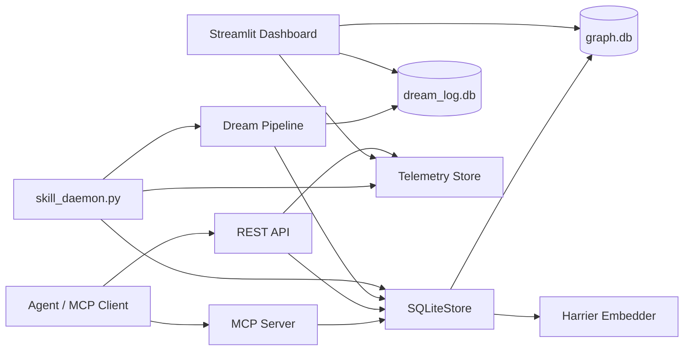
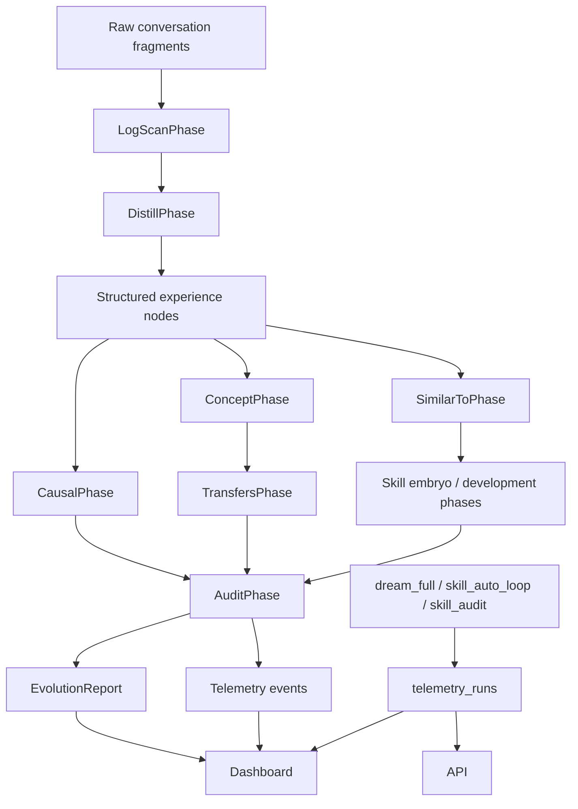
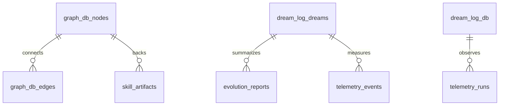

# Mnemosyne Architecture

Mnemosyne is a local-first memory graph for AI agents. The system turns raw interaction fragments into structured memories, graph edges, skills, reports, and active hot-memory context.

## Runtime Map



## Data Flow



## Core Components

- `scripts/core/sqlite_store.py`: storage boundary for nodes, edges, search, skill artifacts, and field contract enforcement.
- `scripts/core/contracts.py`: shared serialization/deserialization contract for node JSON fields and query responses.
- `scripts/core/dream_pipeline.py`: phase orchestration, dream logging, EvolutionReport generation, and telemetry persistence.
- `scripts/core/telemetry.py`: local `telemetry_runs` persistence for daemon/job observability.
- `scripts/mcp_server/__init__.py`: MCP tools for V8 evidence-governed memory lifecycle (19 v8_* tools).
- `scripts/api/start_api.py`: REST surface for memory operations, reports, and telemetry.
- `scripts/skill_daemon.py`: scheduled dream + skill governance loop.
- `scripts/dashboard/`: local Streamlit dashboard for operational visibility.
- `demo/run_demo.py`: safe cold-start user-story demo on temporary databases.

## Dream Pipeline Contract

Full dream mode runs:

```text
SnapshotPhase
SimilarToPhase
LogScanPhase
DistillPhase
CausalPhase
ConceptPhase
TransfersPhase
ContradictsPhase
SkillEmbryoPhase
SkillDevelopmentPhase
SkillMirrorEvolutionPhase
StrategyPhase
CovenantPhase
DecayPhase
SyncPhase
LLMReviewPhase
AuditPhase
```

Key guarantees:

- `SnapshotPhase` captures caps for `AuditPhase` before graph mutations.
- `CausalPhase` only creates `solves` edges from structured metadata evidence.
- `ConceptPhase` creates concept nodes only from cross-task clusters.
- `TransfersPhase` derives cross-domain transfer edges from concept membership.
- `DecayPhase` does not revive cold raw nodes.
- `AuditPhase` turns graph health problems into `WARN` status.
- Every dream writes `dreams`, `evolution_reports`, and `telemetry_events` rows in `dream_log.db`.
- Every daemon job writes a `telemetry_runs` row with status, duration, summary, and errors.
- Every reviewable report item should carry target IDs, evidence IDs, a reason, and a suggested action.

## Persistence



- `graph.db` stores long-lived memory graph state. Do not commit it.
- `dream_log.db` stores operational dream history, reviewable reports, phase telemetry, and daemon run history. Do not commit it.
- `hot/memory.md` is generated by `SyncPhase` from hot nodes.
- `skills/skill-embryo*/` are generated skill artifacts and should not be committed unless explicitly reviewed.
- `demo/seed_conversations/` contains safe public seed data; demo output databases are temporary or kept only by explicit `--keep`.

## Observability Contract

Mnemosyne should not ask users to trust a black box.

- Dream phases record duration, status, and payload in `telemetry_events`.
- Dream consolidation writes a reviewable `EvolutionReport` with structured sections and evidence IDs.
- Daemon jobs (`dream_full`, `skill_auto_loop`, `skill_audit`, and demo jobs) write persistent `telemetry_runs` rows.
- Failures must persist as `FAIL` with errors, not disappear into console logs.
- Dashboard and REST API expose both reports and run history.

## Functional Completion Contract

Code and tests are support tools. The acceptance target is user-visible function:

- A report is useful only if it answers what changed, why, what evidence supports it, and what action is recommended.
- Skill evolution is useful only if baseline-vs-with-skill evidence improves behavior and graph governance can explain the decision.
- Telemetry is useful only if a user can diagnose whether background learning ran, failed, skipped work, or produced audit requirements.
- A demo is useful only if it proves the user story end to end with explicit PASS checks.

## Testing Boundaries

- `tests/test_dream_phase_contract.py` locks deterministic behavior for high-risk Dream phases.
- 	ests/test_v8_mvp.py locks V8 tool contract behavior.
- `scripts/test_contract_roundtrip.py` locks MCP/REST/store edge/search contract behavior.
- `scripts/test_dream_reporting_contract.py` locks EvolutionReport and telemetry persistence behavior.
- `scripts/test_telemetry_runs_contract.py` locks daemon run history persistence and API summary behavior.
- `demo/run_demo.py` is the user-story smoke test for memory -> dream -> report -> skill trial injection -> telemetry.

## Contributor Rules

- Add new node fields through `scripts/core/contracts.py` first, then wire MCP, REST, Store, and tests.
- Do not write raw SQL outside Store unless the operation is explicitly operational logging or migration.
- Do not promote skills based only on dry-run score; approval needs real evidence.
- Keep reports and telemetry structured JSON first; LLM prose can be added later as an optional view.
- Treat versioned design documents as history. The current implementation entry point is this file.
